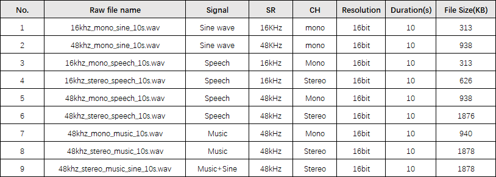

# NXP Application Code Hub
[](https://www.nxp.com)

##  AN13793: FLAC Porting and Codec Performance Evaluation based on i.MX RT685
This application note introduces the FLAC codec library porting on i.MX RT6xx, compares the performance differences between CM33 and HiFi4 DSP, uses the GNU profiler tool to analyze time-consuming functions in the FLAC library, and provides recommendations for further performance optimization on i.MX RT685 evk board.

Please refer to AN13793 for complete instructions on how to use this software.  
https://www.nxp.com.cn/docs/en/application-note/AN13793.pdf


#### Boards: EVK-MIMXRT685
#### Categories: Audio, SDMMC, RTOS
#### Peripherals: SDMMC, UART, GPIO
#### Toolchains: IAR

## Table of Contents
1. [Software](#step1)
2. [Hardware](#step2)
3. [Setup](#step3)
4. [Results](#step4)
5. [FAQs](#step5) 
6. [Support](#step6)
7. [Release Notes](#step7)

## 1. Software<a name="step1"></a>
- SDK: 2.12.1
- [FLAC: 1.3.4](https://xiph.org/flac/)
- [FatFS: R0.14b](http://elm-chan.org/fsw/ff/00index_e.html)
- CM33: IAR embedded Workbench  9.30.1
- HiFi4: Xtensa Xplorer 9.0.18
  


## 2. Hardware<a name="step2"></a>
- Micro USB Cable
- [EVK-MIMXRT685 REV E2 Board](https://www.nxp.com/design/development-boards/i-mx-evaluation-and-development-boards/i-mx-rt600-evaluation-kit:MIMXRT685-EVK)
- Personal Computer
- SD Card

## 3. Setup<a name="step3"></a>
1.  Copy your Music file(.wav format) to SD card;
2.  Insert SD card to EVK-MIMXRT685 board;
3.  Add your music filename to filelist array(main_cm33.c@line_51) and build(Important);
4.  Connect a micro USB cable between the PC host and the Jlink USB port (J5) on the board
5.  Open a serial terminal with the following settings:
    - 115200 baud rate
    - 8 data bits
    - No parity
    - One stop bit
    - No flow control
6.  Download the program to the target board.
7.  Launch the debugger in your IDE to begin running the demo.  


## 4. Results<a name="step4"></a>
The log below shows the output of this demo in the terminal window:
```
FLAC example to demonstrate how to use FLAC with CM33&HiFi4 core.

Please insert a card into board.

Card inserted.
Now timerTicks is 2314

MU example polling!
CM33: input:16khz_mono_sine_10s.wav
input:16khz_mono_sine_10s.wav, filesize is 320044
start encoder #0: compress level:0
wav sample_rate:16000, totalk_samples:160000
Heap addr:163000
encode consume time.60 ms
...
```
## 5. FAQs<a name="step5"></a>
### 5.1 What types of audio are evaluated in this AN?
In order to fully validate and evaluate the FLAC on RT685 EVK, we use below audios:  


### 5.2 What's the workflow of this demo?
We should run CM33 core routine(*CM33_FLAC_TEST*) at first, and then get encode files and decode files which saved on SD card. Then check the files on PC. At last, run HiFi4 routine(*HiFi4_FLAC_TEST*) and compare time-consuming difference.  


 - *CM33_FLAC_TEST* work flow:
    - Step1.CM33 Encode .wav to .flac, encode file save to SD card;
    - Step2.CM33 Decode .flac to .wav, decode file save to SD card;
    - Step3.CM33 Encode .wav to .flac, encode file save to SRAM;
    - Step4.CM33 Decode .flac to .wav, decode file save to SRAM;


 - *HiFi4_FLAC_TEST* work flow:
    - Step1.CM33 start HiFi4
    - Step2.HiFi4 Encode .wav to .flac, encode file save to SRAM;
    - Step3.HiFi4 Decode .flac to .wav, decode file save to SRAM;

### 5.3 How to debug HiFi4 core?
Change *DSP_IMAGE_COPY_TO_RAM* config to 0, then can debug HiFi4 core. For more detailed information please refer to [Getting Started with i.MX RT600 Evaluation Kit](https://www.nxp.com/document/guide/getting-started-with-i-mx-rt600-evaluation-kit:GS-MIMXRT685-EVK).

## 6. Support<a name="step6"></a>
If you need help, please contact FAE or create a ticket to [NXP Community](https://community.nxp.com/).

#### Project Metadata
<!----- Boards ----->
[](https://github.com/search?q=org%3Anxp-appcodehub+EVK-MIMXRT685+in%3Areadme&type=Repositories)

<!----- Categories ----->
[](https://github.com/search?q=org%3Anxp-appcodehub+audio+in%3Areadme&type=Repositories) [](https://github.com/search?q=org%3Anxp-appcodehub+sdmmc+in%3Areadme&type=Repositories) [](https://github.com/search?q=org%3Anxp-appcodehub+rtos+in%3Areadme&type=Repositories)

<!----- Peripherals ----->
[](https://github.com/search?q=org%3Anxp-appcodehub+sdmmc+in%3Areadme&type=Repositories) [](https://github.com/search?q=org%3Anxp-appcodehub+uart+in%3Areadme&type=Repositories) [](https://github.com/search?q=org%3Anxp-appcodehub+gpio+in%3Areadme&type=Repositories)

<!----- Toolchains ----->
[](https://github.com/search?q=org%3Anxp-appcodehub+iar+in%3Areadme&type=Repositories)

Questions regarding the content/correctness of this example can be entered as Issues within this GitHub repository.

>**Warning**: For more general technical questions regarding NXP Microcontrollers and the difference in expected funcionality, enter your questions on the [NXP Community Forum](https://community.nxp.com/)

[](https://www.youtube.com/@NXP_Semiconductors)
[](https://www.linkedin.com/company/nxp-semiconductors)
[](https://www.facebook.com/nxpsemi/)
[](https://twitter.com/NXP)

## 7. Release Notes<a name="step7"></a>
| Version | Description / Update                           | Date                        |
|:-------:|------------------------------------------------|----------------------------:|
| 1.0     | Initial release on Application Code HUb        | June 7<sup>th</sup> 2023 |

